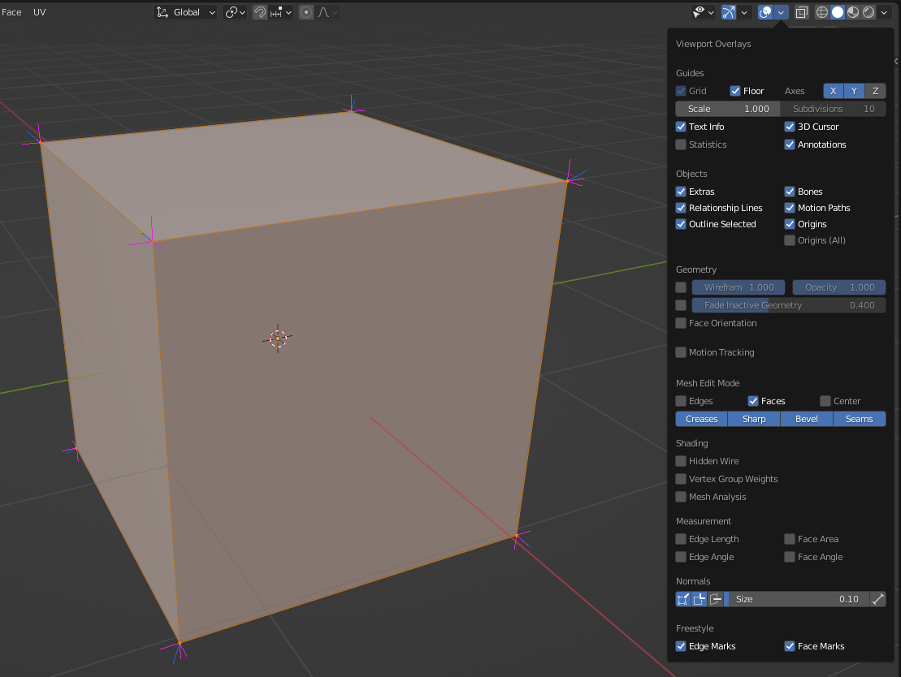
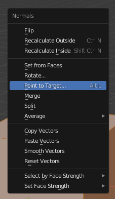
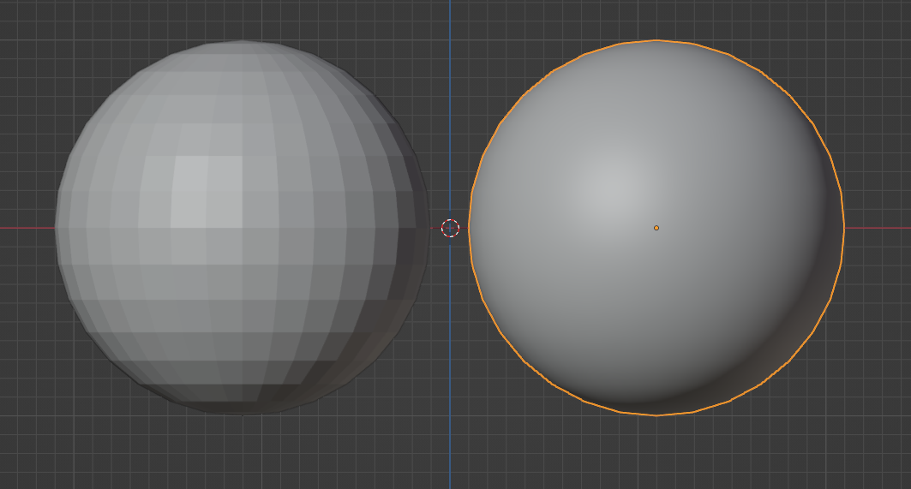
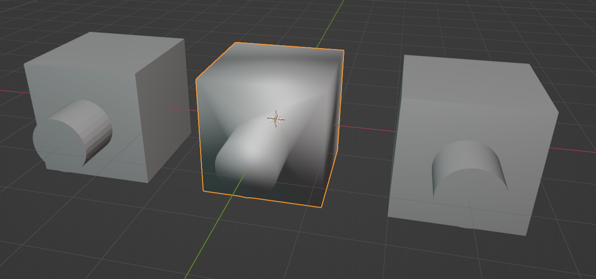
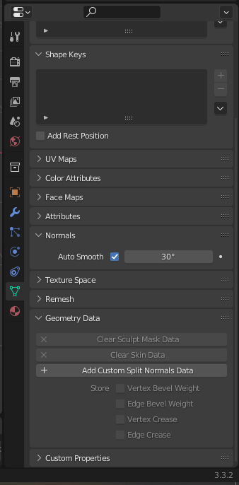
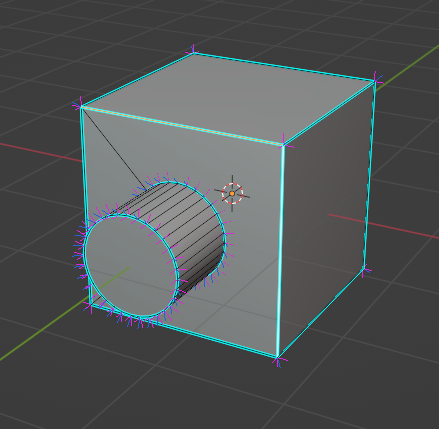
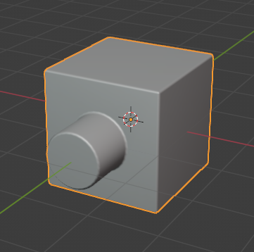
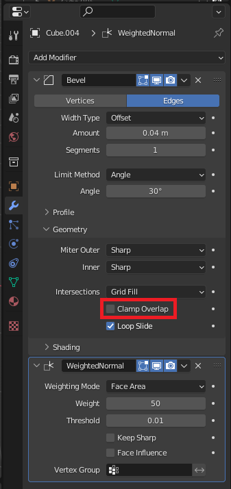

# Custom Split Normals
Custom Split Normals is a way to tweak the mesh shading by pointing normals towards directions other than the default, auto-computed ones. 
It is mostly used in game development, where it helps counterbalance some issues generated by low-poly objects 
(the most common examples are low-poly trees, bushes, grass, etc. and the ‘rounded’ corners).

## Documentation
 - [Normals - Blender Manual](https://docs.blender.org/manual/en/latest/modeling/meshes/structure.html#modeling-meshes-normals-custom)

The first step towards working with Custom Normals is having Blender show them.

Select the object you are working with, enter `Edit Mode`, and in the upper right corner, there is an `Overlays` menu.
In the `Overlays` menu we have the option of displaying "Vertex Normals", "Split Normals" and "Face Normals"

In this example, we are showing both "Vertex Normals" (colored blue) and "Split Normals" (colored pink)

## Custom Normals
[Blender Normal Editing TOOLS (In 2 Minutes!!)](https://www.youtube.com/watch?v=hwhM437Xvks)

Custom Normals refer to the feature of being able to modify the vertex normals as one sees fit.
This can be useful for example in anime characters that usually need specific shading profiles to look good with the toon shader.
One way to accomplish that is by editing the normals of the Mesh.

There are many ways to edit the Normals, one option is to use modifiers and another is to edit the normals directly.

Please consult the video and documentation to know more about editing normals in this way

## Sharp Edges
One of the uses for Custom Normals is to have hard edges on an otherwise smooth mesh.
This allows for a simpler geometry since a smooth mesh gets exported to fewer vertices.
(That is because to have flat shading in OGRE, there have to be as many vertices as normals)

In the Smooth vs Flat shading world, there is a third option in Blender: Auto Smooth, or Smooth with hard edges

Thanks to the Auto Smooth feature, it is possible to have hard edges but also smooth ones in the same mesh.
(This example mesh was made by adding a `Boolean` modifier to the Cube and then performing a Union operation with the Cylinder)

To accomplish this kind of shading, select the Object and make sure you are in `Object Mode`.
Then set the Object shading to "Shade Smooth" (Object -> Shade Smooth (Blender 2.8+))

Then enable "Auto Smooth": (▽ -> Normals -> Auto Smooth) and choose a proper angle.

If you are happy with the results of "Auto Smooth", then enter `Edit Mode` and click on `Add Custom Split Normal Data` (▽ -> Geometry Data -> Add Custom Split Normals Data).

With this operation, Blender automatically marks the Sharp Edges in the mesh and stores the "Custom Split Normal Data" for `blender2ogre`.

If you need to mark other Edges as sharp, because the "Auto Smooth" is insufficient then it is possible to mark more Edges as sharp.

Make sure you are in `Edit Mode` and `Edge Selection Mode`, select the Edges you want to mark as sharp, and then select the option `Edge->Mark Sharp`

## Fillet Edges
[A short explanation about custom vertex normals](https://polycount.com/discussion/154664/a-short-explanation-about-custom-vertex-normals-tutorial)
[Blender: Understanding Custom Split Normals](https://www.youtube.com/watch?v=o-jr_q_pkF0)
Another use for Custom Normals is to have smooth edges (also called Fillet Edges).

To get this kind of shading, select the object.

Add the `Bevel` Modifier, then add the `Weighted Normal` modifier.

The option `Clamp Overlap` should be disabled in some cases where the geometry of the mesh is more complex.

For the `Weighted Normal` modifier to work well, you have to enable "Auto Smooth": (▽ -> Normals -> Auto Smooth)

> NOTE: Until this is fixed, for the Fillet Edges to look correct in the exported Mesh you have to create a copy of the object, apply the modifiers then go into `Edit Mode` and perform a manual triangulation of the Mesh (Face -> Triangulate Faces or Ctrl-T)

