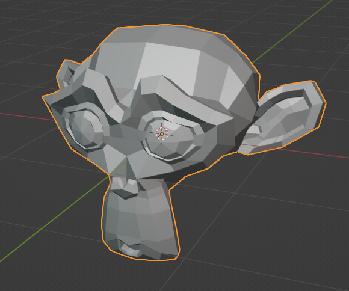
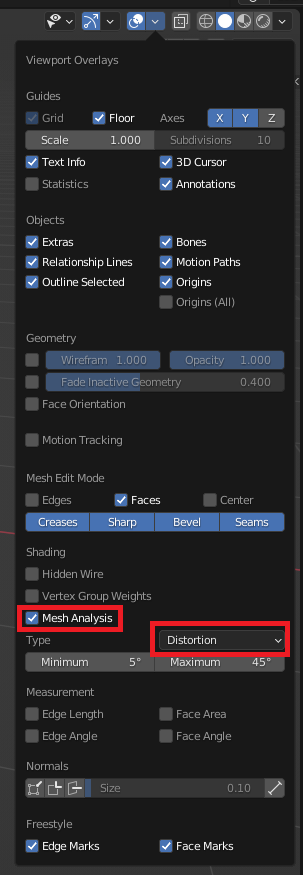
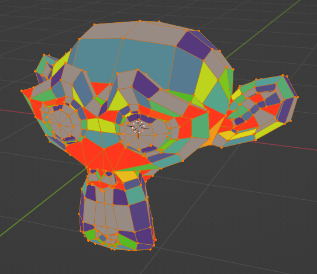
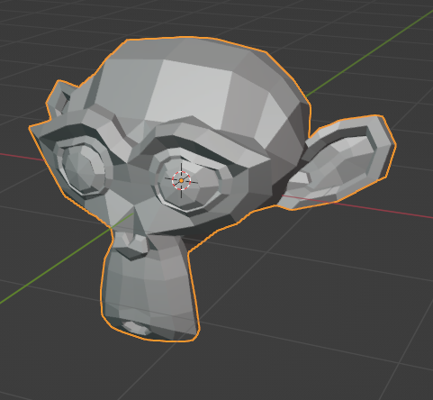
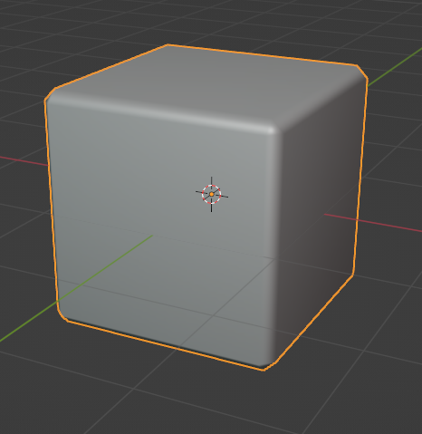
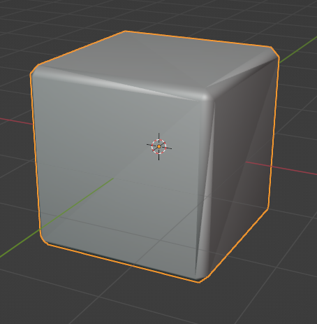

# Mesh Triangulation

While Blender can create meshes featuring triangles, quads and n-gons, OGRE3D being a realtime rendering engine deals only with triangles.
That means that blender2ogre needs to perform a process of mesh triangulation to export the meshes.
Sometimes this triangulation process leads to some problems described here.

## Documentation
 - [How can I manually fix nonplanar geometry?](https://blender.stackexchange.com/questions/119874/how-can-i-manually-fix-nonplanar-geometry)
 - [How to flatten a face to avoid distortion (make an ngon planar)](https://blender.stackexchange.com/questions/7729/how-to-flatten-a-face-to-avoid-distortion-make-an-ngon-planar)
 - [How do I fix this issue with weird faces?](https://blender.stackexchange.com/questions/55466/how-do-i-fix-this-issue-with-weird-faces)
 - [Mesh Analysis - Blender Manual](https://docs.blender.org/manual/en/latest/modeling/meshes/mesh_analysis.html)
 - [When should N-Gons be used, and when shouldn't they?](https://blender.stackexchange.com/questions/89/when-should-n-gons-be-used-and-when-shouldnt-they)
 - [Exporting Blender models for Godot](https://tam7t.com/blender-godot-export)

## Non-coplanar Faces
The first problem happens when during the process of creating a mesh an artist ends up with faces that are not coplanar.
This means that the vertices of the face are not all on the same plane.
For a triangle, the vertices are always on the same plane, but for quads and n-gons that is not necessarily true.

When a mesh has non-coplanar faces, the resulting triangulated mesh looks different than the original.

For a simple example, take a look at Blenders' Suzanne (this mesh has almost 90% non-coplanar faces) with and without triangulation

Suzanne without triangulation | Suzanne with `Triangulate` modifier
:-------------------------:|:-------------------------:
 | 

Blender has tools to detect this type of problems in the mesh analysis section of the Viewport Overlays.

Select the object, then go into `Edit Mode` and in the upper right corner, there is an `Overlays` menu.



Select `Mesh Analysis` and then Type: `Distortion`

Blender will show all the faces that are non-coplanar and how much they deviate from a planar face.



Blender also has a tool to help with this issue.

While in `Edit Mode`, select Mesh -> Clean Up -> Make Planar Faces

It might be necessary to perform this action many times since it is a progressive improvement if there are many non-coplanar faces.

So increasing the factor and the iterations might help, the factor goes from [-10, 10] and the iterations go from [1, 10.000]

```python
import bpy

bpy.ops.mesh.face_make_planar(factor=1, repeat=10)
```

### Shape Keys

An issue caused by having non-coplanar faces is that since the triangulated mesh looks different from the original, the shape keys will tend to look more like the original mesh.
That is because the data that Blender is providing to the exporter (particularly the normals) is not triangulated because the modifier does not apply to the Shape Keys.
The result is that when using the Shape Keys or Shape Animations in OGRE the mesh changes in unintended ways.

In the following example, we created a Shape Key where Suzanne is worried.
When applying the Shape Key in OGRE the normals are that of the original mesh and so it "looks" like the triangulation is gone.

Suzanne with `Triangulate` modifier | Suzanne in "worried" pose
:-------------------------:|:-------------------------:
 | 

The fix is to avoid using non-coplanar faces or trying to fix them when they appear as a result of the modeling process.


## Custom Normals
Bugs reported to https://developer.blender.org
 - [Triangulate modifier breaks custom normals](https://developer.blender.org/T61942)
 - [Triangulate faces sometimes produce degenerate triangle faces](https://developer.blender.org/T103913)
 - [Triangulate non-planar faces with "beauty" method produces faces that point in different directions](https://developer.blender.org/T85402)
 - [Shading is broken with Custom Normals + Triangulate Modifier](https://developer.blender.org/T104244)

There are outstanding issues when using custom normals and Blenders' mesh triangulation, this is not only relegated to mesh triangulation but other tools as well.

So be careful when using Custom Normals (that is modifying normas by using some Modifier like Weighted Normal or directly editing the Normals in `Edit Mode`).

One way to check if the exported object will look good is to add `Triangulate` modifier with quad method `Fixed`, if the shading looks wrong compared to removing the modifier then it will look wrong in OGRE as well since the exporter is using Blenders triangulation code to perform the calculations.

For example, this cube has had a `Bevel` modifier and a `Weighted Normals` modifier applied, then we add a `Triangulate` modifier and the result is that there are visible triangles in the shading of the cube.

Cube without triangulation | Cube with triangulation
:-------------------------:|:-------------------------:
 | 

> NOTE: Until this is fixed, for the Fillet Edges to look correct in the exported Mesh you have to create a copy of the object, apply the modifiers then go into `Edit Mode` and perform a manual triangulation of the Mesh (Face -> Triangulate Faces or Ctrl-T)

