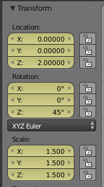
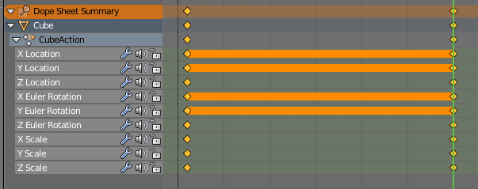
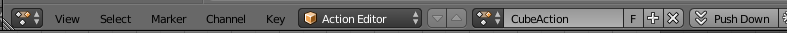
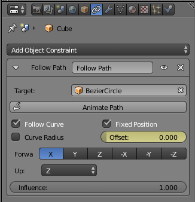

# Exporting Node Animations

## Introduction
It is possible to export some animated properties of objects in Blender, that is: location, rotation and scale.

This results in what is called SceneNode Animation (https://ogrecave.github.io/ogre/api/1.12/_animation.html#SceneNode-Animation) in Ogre.

This kind of SceneNode animation is very useful to animate the movement of a camera, a character patrolling in a game and any other kind of animation one can think of.

The advantage over skeletal animation is that it is more performant due to its simplicity, the effect (tranlation/rotation/scale) is applied to the Node and its children (if `setInherit()` is true).

## About exporting and importing into Ogre
The exported animation data goes into the .scene file describing the whole Scene crafted in Blender, there isn't a serializer for SceneNode Animation data, so this data has to be processed by the DotScene plugin.

Refer to the DotScene documentation (https://github.com/OGRECave/ogre/tree/master/PlugIns/DotScene) on how to load the .scene file into your Ogre application. 

The animation is being exported frame by frame with Blender doing the interpolation between keyframes.
This has the advantage that any tuning done to the F-Curves is being preserved in the exported animation. 
Another advantage is that it is not necessary to choose an interpolation method other than IM_LINEAR on the Ogre side, making the animation more performant.

The disadvantage is that the .scene file is now less human readable due to the chunk of data from all the animation frames and there is no control of the animation in the code.
Another disadvantage is that the timing of the frames will be interpreted according to Blenders current FPS setting which is by default 24 fps.
This setting can be changed in the `Render Tab`, `Dimensions Panel`, there is a drop down list named `Frame Rate` where you can select a value or create a new one with custom.

In a similar fashion to the exporting of Sekeletal Animation, every action should go into an NLA Track in order to have it exported (the name of the exported animation being that of the action).

The reason for using NLA Tracks is to have better control over what actions should be exported as animations.

## Animating an object
Here is a short video on how to animate objects in Blender:
[How To Move Animated Objects (Blender Tutorial)](https://www.youtube.com/watch?v=HPD3LhCLxCE)

We will use the default cube to simplify things.

Just select the cube and toggle the `Transform` properties with the keyboard shortcut `N`.



Make sure that the current frame is `1` and with the mouse cursor over one of the `Location` properties, press `I`.

This has the effect of automatically creating an action called `CubeAction` and inserting a Keyframe at frame `1`.

Do the same for `Rotation` and `Scale`.

Then jump to frame `30` and change `Location.Z` to `2m`, `Rotation.Z` to `45º` and `Scale.XYZ` to `1.5`.

Hover the mouse cursor on `Location`, `Rotation` and `Scale` pressing `I` to insert a Keyframe at frame `30`.



Play the animation and you will see the cube go upwards, increase in size 1.5 times and rotate 45º degrees to the right.

Don't forget to `Push Down` the action from the `Action Editor` to put it into the NLA stack for before exporting.



## Having an object follow a path
Here is a short video on how to have an object follow a path in Blender
[Create Path For Any Object To Follow - Blender (BEGINNERS)](https://www.youtube.com/watch?v=G6NdQGySZhU)

### Simple Path Following
For this simple tutorial we will use the default cube to follow a path in Blender.

Create a new scene and select the default cube.

Press `Shift-A` to open the `Add` menu and add a circle (`Curve -> Circle`).

Scale the circle to four times its size by pressing `S` and then move the mouse to increase the size of the circle so you have a decent sized path.

Now, select the cube and go to the `Constraints` tab and click on `Add Object Constraint` to add a new constraint.

Select the `Follow Path` constraint to have the cube following the circle as a path.



Now, set the "BezierCircle" as the `Target`, click on `Follow Curve` and `Fixed Position`.

With meshes not as symmetrical as the cube you might have to fiddle with the `Forward Axis` to have the meshes front facing the direction of the path.

To have an animation of the cube following the path, hover the mouse over the `Offset` slider and press `I` to insert a Keyframe at frame 1.

Select frame 60 and change the value of the `Offset` slider to 1.0 and press `I` to insert a Keyframe at frame 60.

The cube follows the path but the speed is not constant, to have a constant speed it is necesary to modify the `F-Curve` and set it to linear interpolation.

To do this, go to the `Graph Editor` and select `Key->Interpolation Mode->Linear`, now the cube will follow the path at a constant speed.

To have a path that is more sinusoidal than circular it is possible to also use a `Bezier Curve` as the `Target` of the `Follow Path` constraint.

If you want this path to loop on itself press `Alt-C` when editing the `Bezier Curve` in edit mode (also `E` adds more segments to the curve).

To export a .scene with the animated cube following the path, the last step is to add an NLA Track so that the exporter knows which action to export.

Go to the `Dope Sheet`, change the mode to `Action Editor` and select `Push Down` to add the action to the NLA stack. 


### Path Following with Skeletal Animation
In order to have an animated character follow a path there are a couple of things to take into account.

It is very important to parent the animated character armature to an empty object.
Add the empty object with `Shift-A->Empty->Plain Axes`, then select the armature and afterwards select the empty by pressing `Shift` to have both objects selected in the proper order.
Press `Ctrl-P` to get the `Parent` menu and select `Object (Keep Transform)`.
Having the Armature being a child of the empty object allows us to have the path following be independent of the Armature actions.

The second advantage of having the Armature parented to an empty is that it is possible to control the scale of the animated character without breaking the animations.

Just set the desired scale of the empty object and the armature will inherit that scale, the exported .scene will have an Ogre SceneNode with the name of the empty as a parent of the Armature SceneNode.

### Path Following with Camera Tracking
To have a camera following a path and tracking a target we will be combining the things learned in the previous sections.

Create a new scene and delete the default cube.

Add three empty objects (3 x `Shift-A->Empty->Plain Axes`) and name them as follows: *Tracked*, *CameraBase* and *CameraArm*.

Parent the empty *CameraArm* to *CameraBase* so that the arm is a child of the base, and then parent the camera to *CameraArm*.

Clear the camera location and rotation by pressing `Alt-G`, `Alt-R`.

Add a Monkey mesh with `Shift-A->Mesh->Monkey` to have some object for the camera to look at.

Then add a BezierCircle to have a path to follow, scale it and name it *CameraPath*.

Select the *CameraBase* empty and add a constraint to follow the *CameraPath* bezier curve with `Forward:` -X and `Up:` Z (also check `Follow Curve` and `Fixed Position`).

Select the *CameraArm* empty and move it upwards so that the camera is looking the object from a vantage point and not the floor.

Then select the camera and add a constraint of type `Locked Track`, with `Target:` *Tracked*, `To:` -Z and `Lock:` X.

The purpose of having the camera track the *Tracked* empty object instead of the Monkey mesh is that now it is not locked to the center of the object.

If the Monkey object is going to move as well, then the *Tracked* empty object can be made a child of the Monkey object or use more empty objects to move the monkey.

It is a good general rule to separate movements into indepentent nodes as was done with *CameraBase* and *CameraArm* that are generally used to separate the yaw and pitch of the camera.

Now, select *CameraBase* and repeat the process as in the previous tutorial to have the *CameraBase* empty follow the circular path, in the process the camera will keep on tracking the *Tracked* empty object.

It should be noted that Ogre has a `setAutoTracking()` function for the SceneNodes, which would be a preferable way to track objects.

Please consult the manual for more details: https://ogrecave.github.io/ogre/api/latest/class_ogre_1_1_scene_node.html#ae4c8588895d3623bbe0007ea157af1a4

## Using Node Animations in you Ogre app
If you are using DotScene to load the .scene into your Ogre app, by default the animations won't play because they are disabled by default.

Besides enabling the animations it is also required to `addTime()` to their *AnimationStates*, we will use a controller for that.

```
int main()
{
	...
    auto& controllerMgr = Ogre::ControllerManager::getSingleton();
	
    for (auto animationState : mSceneMgr->getAnimationStates())
    {
		// Print the animation name
		std::cout << "animationState: " << animationState.second->getAnimationName() << std::endl;
		
		// Enable the Animation State (they are disabled by default)
		animationState.second->setEnabled(true);
		
		// Set the animation to looping (if your node animation loops)
		animationState.second->setLoop(true);
		
		// Create a controller to pass the frame time to the Animation State, otherwise the animation won't play
		// (this is a better method than using animationState->addTime() in your main loop)
		controllerMgr.createFrameTimePassthroughController(Ogre::AnimationStateControllerValue::create(animationState.second, true));
    }
}
```

Consult the Ogre manual for further information:
 - https://ogrecave.github.io/ogre/api/latest/class_ogre_1_1_scene_manager.html
 - https://ogrecave.github.io/ogre/api/latest/class_ogre_1_1_animation_state.html
 - https://ogrecave.github.io/ogre/api/latest/class_ogre_1_1_scene_node.html
 - https://ogrecave.github.io/ogre/api/1.12/class_ogre_1_1_controller_manager.html
 - https://ogrecave.github.io/ogre/api/1.12/class_ogre_1_1_controller.html

## Troubleshooting
Some tips for troubleshooting:
 - Make sure that the actions/animations you want to export have their corresponding NLA tracks associated with the object.
 - To use Skeletal Animation combined with path following remember to have the armature be a child of an empty to avoid problems.
 - Check the .scene file to see if the animation was exported as expected, the problem might not be in the exported data.

## Automation
If you have many actions it can become tiresome to push every one of them into the NLA stack to have them exported.

Here is a very simple Blender script to add every action as an NLA track, any action which should not be exported can simply be deleted from the list of NLA Tracks

Switch to the `Scripting` layout and copy the following script:

```
import bpy

def add_NLA_strips(object):

    for action in bpy.data.actions:
        track = bpy.data.objects[object].animation_data.nla_tracks.new()
        track.strips.new(action.name, action.frame_range[0], action)
        track.name = action.name

# Add actions from a single object:
add_NLA_strips('Cube')

# Add actions for every object:
for object in bpy.data.objects:
	add_NLA_strips(object)
```
