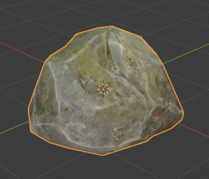
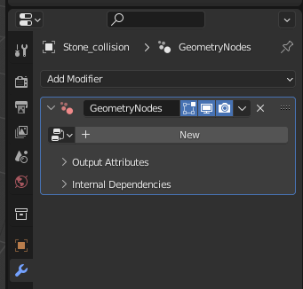
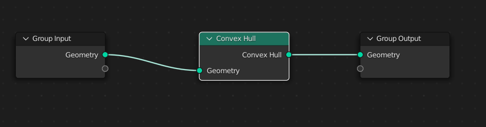
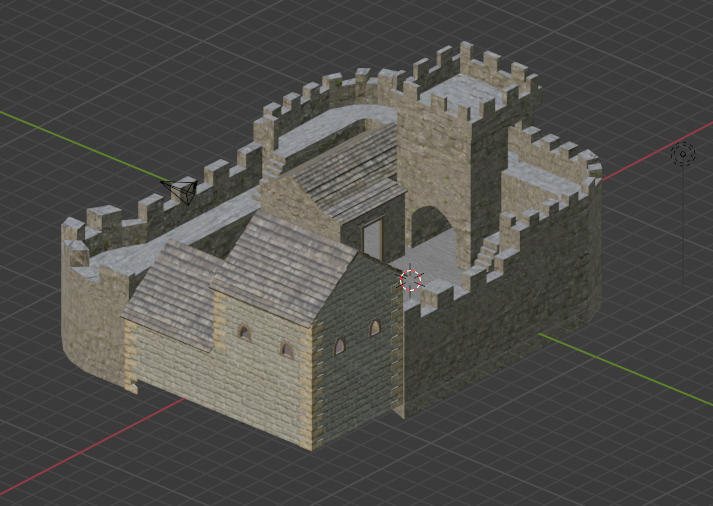
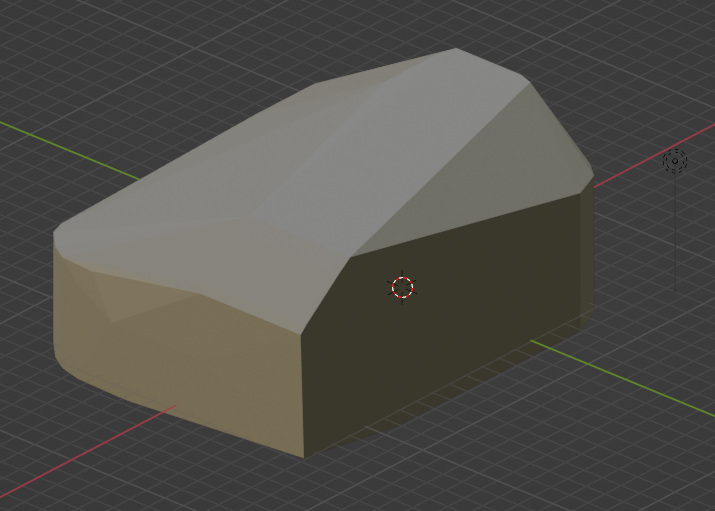
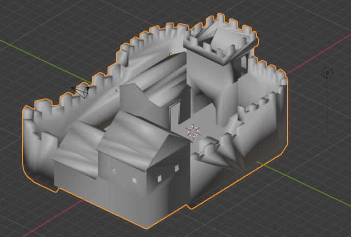

# Exporting for Physics Engines

## Index
 - [Introduction](#introduction)
 - [Creating a Convex Hull](#creating-a-convex-hull)
 - [Using the Decimate Modifier](#using-the-decimate-modifier)

## Introduction
Since OGRE3D is a graphics engine, if you are interested in making a game then you are probably also using a physics engine.
Some of the most popular physics engines are:
 - [Havok Physics](https://www.havok.com/)
 - [NVIDIA PhysX SDK](https://github.com/NVIDIAGameWorks/PhysX)
 - [Bullet Physics](https://pybullet.org/wordpress/)

In the case of Bullet Physics, there is even an official OGRE Component that connects OGRE objects to the Bullet Physics world ([Bullet-Physics to Ogre connection](https://ogrecave.github.io/ogre/api/13/group___bullet.html#details)).

One common issue when using physics engines that relates to `blender2ogre` is the creation of collision meshes or hulls.

For the physics engine to operate at maximum efficiency the collision shapes in the world should be [Convex Hulls](https://en.wikipedia.org/wiki/Convex_hull).

So when creating a level in Blender and then exporting the mesh to render into OGRE3D, the same mesh or the same arrangement of vertices would in most cases be very inefficient to use as a collision mesh.

## Creating a Convex Hull
> **WARNING**: This section covers a feature only available since Blender version 3.0 (Geometry Nodes + Convex Hull)

In general for collision testing, it is most efficient to use the physics engines' primitive shapes, so if the asset can be put within one of these shapes it will consume fewer CPU resources (for example a barrel within a Cylinder Collision Shape).

Primitive shapes:
 - Sphere Shape
 - Plane Shape
 - Box Shape
 - Cylinder Shape
 - Capsule Shape
 - Cone Shape

Complex shapes:
 - Compound Shape (Collection of primitive shapes)
 - Convex Hull Shape (A good analogy for a convex hull is an elastic membrane or balloon under pressure which is placed around a given set of vertices)
 - Triangle Mesh Shape (A triangle mesh shape is similar to the convex hull shape, except that it is not restricted to convex geometry)
 - Heightfield Shape (Used for terrain, because it can take elevation data from an image)
 - Soft Body Shape

Primitive shapes don't concern us in this document, since they can be easily created in OGRE.
For example `Ogre::Bullet::createSphereCollider( const MovableObject * mo )` would create a Sphere Shape for the provided OGRE Movable Object (like an Entity).

Our concern is regarding more complex objects that require a more detailed collision shape that better fits the shape of the object.

An example could be some rocks that the player can climb on top of.
None of the primitive shapes approximate the random shape of a rock and if we tried the mismatch between the visual and the physical would be awkward for the player.

For this example, we are going to use the [Mossy Stone Rock](https://opengameart.org/content/mossy-stone-rock) from OpenGameArt.

To create a collision mesh of type Convex Hull for this object first we are going to duplicate it with `Shift-D`.

Rename the cloned object to "Stone_collision" (usually collision meshes are named like this to distinguish from the visual mesh).

With the cloned object selected go to Modifiers and add the `Geometry Nodes Modifer`.

Create a new Geometry Node and then change the Layout to `Geometry Nodes` (layouts are in the top bar in Blender)

Now add a `Geometry Node` of type Convex Hull (Add (Shift-A) -> Geometry -> Convex Hull) and put the node between the `Group Input` and the `Group Output`

This will give you a simplified convex version of the mesh that can be exported by blender2ogre and then used as a collision shape in Bullet or even PhysX.

> NOTE: Very important!
Before exporting the mesh remember to set the shading to `Shade Smooth` (Object -> Shade Smooth), this is because `Flat Shading` makes `blender2ogre` export more vertices that would be necessary for this case.
Also, remember to remove the material since the collision mesh won't need it.

## Using the Decimate Modifier
But what if you want to use a model like this one:

[Stronghold](https://opengameart.org/content/stronghold) from OpenGameArt.

The object looks like this in Blender:

If we use a `Geometry Node` to create a Convex Hull, the result looks like this:

So, this cannot be used as a place where the player can go around going into the Stronghold and picking up loot.

In this case, a better approach is to duplicate the object and then add the `Decimate Modifier`.
Use the `Collapse` option and play with the `Ratio` lowering it as much as possible until the geometry starts collapsing too much.
Also:
 - Use the `Clean Up` menu (`Edit Mode`, Mesh -> Clean Up) to clean up the mesh to avoid as much degenerate geometry as possible.
 - Set the shading to `Shade Smooth` (Object -> Shade Smooth), this is because `Flat Shading` makes `blender2ogre` export more vertices that would be necessary for this case.
 - Remove the materials since the collision mesh won't need it.
 - This model has some ornaments that can be removed, like the window and door ledges which also reduces the complexity of the model.

The result is an object that looks bad but has a lower vertex count which will improve performance for the physics engine when calculating collisions.

