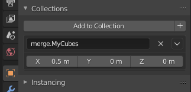

# blender2ogre #

* License: [GNU LGPL](http://www.gnu.org/licenses/lgpl.html)
* [Ogre forum thread](https://forums.ogre3d.org/viewtopic.php?f=8&t=61485)

**This versions requires Blender 2.8+.** For Blender 2.7x: [use the 2.7x-support branch](https://github.com/OGRECave/blender2ogre/tree/2.7x-support)

## Index
 - [Installing](#installing)
 - [Updating to new versions](#updating-to-new-versions)
 - [Video Tutorials](#video-tutorials)
 - [Exporting Meshes](#exporting-meshes)
   	- [Output Filenames](#output-filenames)
	- [OgreNext Tips](#ogrenext-tips)
 - [Importing Meshes](#importing-meshes)
 - [Additional Features](#additional-features)
	- [Merge Objects on export](#merge-objects-on-export)
	- [External OGRE Materials](#external-ogre-materials)
	- [Console Export](#console-export)
	- [Exporting Custom Vertex Groups](#exporting-custom-vertex-groups)
	- [Exporting Skeletal Animations](#exporting-skeletal-animations)
	- [Exporting Particle Systems](#exporting-particle-systems)
	- [Exporting Shape (or Pose) Animations](#exporting-shape-animations)
	- [Exporting Node Animations](#exporting-node-animations)
 	- [Mesh Previewer](#mesh-previewer)
 - [About](#about)
 - [Authors](#authors)

## Installing
1. Copy the [io_ogre](io_ogre) folder into the [$BLENDER_DIR](https://docs.blender.org/manual/en/latest/advanced/blender_directory_layout.html)`/scripts/addons` folder.
2. Enable the addon in Blender: `Edit menu > Preferences > Add-ons`. Search for `'ogre'` and click the box up the top left.
3. Configure the plugin prior to the first run.
	- Set the correct path to `OGRETOOLS_XML_CONVERTER` 
		- for Ogre (v1): path should point to `OgreXMLConverter.exe`. This can be found in the [Ogre SDK](https://www.ogre3d.org/download/sdk/sdk-ogre)
		- for OgreNext (v2): path should point to `OgreMeshTool.exe`. This can be found in the [OgreNext SDK](https://www.ogre3d.org/download/sdk/sdk-ogre-next)
	- *OPTIONAL* Set `MESH_PREVIEWER` to a path pointed to `ogre-meshviewer.bat`. This can be found in [OGRECave/ogre-meshviewer](https://github.com/OGRECave/ogre-meshviewer/releases)      
  	- Make sure that `USER_MATERIALS` isn't set to a directory like "C:\\\". The addon scans this path recursively and will crash when it hits a path it doesn't have permissions for.

## Updating to new versions ##
If you are upgrading from a previous version of blender2ogre, and having problems, you may want to delete your old .pickle config file from
[$BLENDER_DIR](https://docs.blender.org/manual/en/latest/advanced/blender_directory_layout.html)`/config/scripts/blender2ogre.pickle` and restart blender.

## Video Tutorials
* [General Usage](http://www.youtube.com/watch?feature=player_embedded&v=3EpwEsB0_kk)
* [Animations](http://www.youtube.com/watch?feature=player_embedded&v=5oVM0Lmeb68)
* [Meshmoon: Video and text instructions how to install and use blender2ogre addon](http://doc.meshmoon.com/index.html?page=from-blender-to-meshmoon-part-1)

## Exporting Meshes
To export a blender model: `File Menu > Export > Ogre3D (.scene & .mesh)`. If the menu button is greyed out, the select the object to export from the blender Node tree (Scene collections) first. 

- If you have `OGRETOOLS_XML_CONVERTER` set to a "OgreXMLConverter.exe" path, then the export dialogue will display options relevant for the Ogre (v1) mesh format.
- If you have `OGRETOOLS_XML_CONVERTER` set to a "OgreMeshTool.exe" path, then the export dialogue will display options relevant for the OgreNext (v2) mesh format. 

#### Output Filenames
The output file names are determined as per the following:

* If the collection name (Yellow box 1) *doesn't* have the prefix "merge." then the mesh filename is taken from the Scene Collection Node at location `[Red box 3]`. In this example: **CubeBig.mesh**
* If the collection name (Yellow box 1) *does* have the prefix "merge." then the mesh filename is taken from the Scene Collection Node at location `[Yellow box 1, minus the 'merge.' prefix ]`. In this example: **CubeMerge.mesh**
	- For more information on merging see the heading: [Merge Objects on export](#merge-objects-on-export)
* The material filename is taken from the export dialogue filename text box at location `[Red box 2]`. The ".material" file extension is automatically added. In this example the output material name would be: **CubeSmall.material**
* The material definition names are taken from the material names in the Scene Collection Node `[Red box 4]`. In this example: **CubeMaterial**

#### OgreNext tips
If you do want to export in the OgreNext (v2.) format, make sure in the `Export dialogue > General Settings > Mesh Export Version` is set to V2. The following parameters are a good start point to get a model exported to an Ogre mesh:
* General
  - Mesh export version: v2
* Materials
  - Export materials: ticked
* Armature
  - Armature animation: ticked
* Mesh
  - Export mesh: ticked
  - Edge lists: un-ticked
  - If your model's materials contain normal mapping:
    - Tangents: "generate with parity"
    - Else Tangents: "none"
  - Optimise Vertex buffers for shaders: ticked
  - Vertex buffer options: **puqs**

You can check the arguments passed to `OgreMeshTool.exe` in the Blender console. (`Window Menu > Toggle System Console`)

Blender will export the material format in a Ogre (V1) format. This is not compatible with OgreNext (V2.*). You should manually convert them to a material.json file. See the [Ogre Wiki: HLMS Materials](https://wiki.ogre3d.org/HLMS+Materials) for more information.

## Importing Meshes
As of `blender2ogre` version *0.8.2*, the Kenshi Importer has been integrated into `blender2ogre` with the following features:
 - Import mesh from `.xml` as well as `.mesh` files
 - Option to be able to merge imported submeshes or keep them separate
 - Parsing/Conversion of materials into Blender (just create a Principled BSDF material and add a texture with the proper UV mapping)
 - Importing of Poses
 - Importing of Skeletons work for the most part, but Ogre skeletons conventions are not like Blenders (see: [How to get bone's vector and bone's length?](https://forums.ogre3d.org/viewtopic.php?t=49689))
 - Importing of Animations work, but depend on the skeleton which sometimes doesn't get correctly imported

> **NOTE:** Orientation of the imported mesh is assumed to be `xz-y` (Ogre default), the `blender2ogre` Axis Swapping option does not work for the importing process.

## Additional Features

### Merge Objects on export
You might have hundrets of objects, which you want to keep separate but have them in one `.mesh` on export.
For this create a new collection (M) named as `merge.<yourname>`. The output will be a single `<yourname>.mesh` file. Alternatively link the collection.

> **NOTE:** The origin of the resulting merged object will be that of the *last* object you added to the collection (although when reloading the blend file, this order will be lost).
In order to have control over the precise location of where the merged objects origin will be, use the `dupli_offset` property of the collection.
Setting any value other than the default `(0, 0, 0)` will result in a mesh with the origin set to that value. For example:



### Instancing and DotScene Plugin
As of OGRE 1.13 a new feature has been added to the DotScene Plugin where it now accepts the static / instanced keywords for entities.
(for more information read the [DotScene Plugin README](https://github.com/OGRECave/ogre/blob/master/PlugIns/DotScene/README.md)).

To use this feature create a new collection (M) names as `static.<Group Name>` or `instanced.<Instance Manager Name>` and blender2ogre will automatically add the corresponding attribute to the exported entities in the Scene.
This feature goes hand in hand with [Exporting Particle Systems](#exporting-particle-systems) to create vegetation, debris and other static objects in your scene.

### External OGRE Materials
You might already have some materials in OGRE that you do not want to export.
Prefix them with `extern.<yourname>` and the sub entity will have the material name set, but the material is not exported. 
The following material 'vertexcolor' can be defined in your OGRE project:


### Console Export
You might have several blender files in your project you want to export to Ogre. Do this by hand? NO! You can do better!
Here is how you can export a scene with blender2ogre.

```sh
blender test.blend -b --python-expr "import bpy;bpy.ops.ogre.export(filepath='test.scene')"
```

### Exporting Custom Vertex Groups
As shown in the picture below, you can now export SubEntities that contain a user defined amount of faces.


You simply call your vertex group with the
prefix `ogre.vertex.group.<yourname>` and access it in Ogre similar to the following:

```cpp
void example(const Ogre::Entity * entity)
{
    auto collision = entity->getSubEntity("collision");
    auto mesh = collision->getSubMesh();
    VertexData * data = nullptr;
    if (!mesh->useSharedVertices) {
        data = mesh->vertexData;
    } else {
        data = mesh->parent->sharedVertexData;
    }
    auto pos_cursor = data->vertexDeclaration->findElementBySemantic(Ogre::VES_POSITION);
    auto vbuffer = data->vertexBufferBinding->getBuffer(pos_cursor->getSource());
    auto ibuffer = mesh->indexData->indexBuffer;

    uint16_t * indices = static_cast<uint16_t*>(ibuffer->lock(Ogre::HardwareBuffer::HBL_READ_ONLY));
    float * vertices = static_cast<float*>(vbuffer->lock(Ogre::HardwareBuffer::HBL_READ_ONLY));
    float * v;
    int count = mesh->indexData->indexCount;
    int stride = vbuffer->getVertexSize() / 4;
    for (int i = 0; i < count; i+=3) {
        uint16_t a = indices[i], b = indices[i+1], c = indices[i+2];
        pos_cursor->baseVertexPointerToElement(vertices + a * stride, &v);
        Vector3 va(v);
        pos_cursor->baseVertexPointerToElement(vertices + b * stride, &v);
        Vector3 vb(v);
        pos_cursor->baseVertexPointerToElement(vertices + c * stride, &v);
        Vector3 vc(v);
        // do something with your triangle here
    }
    ibuffer->unlock();
    vbuffer->unlock();
}
```
The vertex group will get the material name 'none' so you might want to add the following script:

```
material none {
    technique {
        pass {
           // ...
        }
    }
}
```

### Exporting Skeletal Animations


Skeletal Animation refers to the technique of using bones to deform a mesh as if the mesh were the skin.
This kind of animation is commonly used to animate characters in videogames.
Check out the [Skeletal Animations README](SkeletalAnimation.md) to see how to create and export an animated mesh.

### Exporting Particle Systems


A common technique for laying out random objects on a scene in Blender is to use the Particle System. 
Check out the [Particle System README](ParticleSystem.md) to see how to create and export a scene where the trees, foliage and rocks are distributed randomly using a particle system.

### Exporting Shape Animations


Shape (or Pose) Animations allow animating different poses, a technique commonly used to do face animations.
Check out the [Shape Animations](ShapeAnimations.md) tutorial to see how to create some poses and animate them. 
Then you can use `blender2ogre` to export the poses and animations into a `.mesh` file.

### Exporting Node Animations
Node Animations are a way to have scripted node animations in your Ogre application.
Check out the [Node Animations](NodeAnimations.md) tutorial to see how to create some animations for a couple of different scenarios.

### Mesh Previewer
If `MESH_PREVIEWER` is set, a button will appear allowing you to preview your mesh in Ogre3D. If the button isn't there, the path is invalid. This only works for Ogre (V1) meshes.
The button is located here:


## About
[The original version of this](https://code.google.com/archive/p/blender2ogre/) was a *single* monolithic Python file.
This is not maintainable, and contains a tremendous amount of bugs. There was the need to export blender model to ogre from
the console, thus I rewrote the whole script and split it into several files.
It has been well tested on linux 64-bit and should work with others.

## Authors
This Blender addon was made possible by the following list of people. 
Anyone can contribute to the project by sending bug reports and feature requests [here](https://github.com/OGRECave/blender2ogre/issues). 
Naturally the most welcome contribution is actual code via [pull requests](https://github.com/OGRECave/blender2ogre/pulls). 
If you are planning to implement something "big", it's a good practise to discuss it in the issue tracker first with other authors. 
So that there is no overlap with other developers or the overall roadmap.
 
* [Git Contributors](https://github.com/OGRECave/blender2ogre/graphs/contributors)
* [Brett](http://pyppet.blogspot.fi/)
* S. Rombauts
* F00bar
* Waruck
* [Mind Calamity](https://bitbucket.org/MindCalamity)
* Mr.Magne
* [Jonne Nauha](https://bitbucket.org/jonnenauha) aka Pforce
* vax456
* Sybren Stüvel

Additionally the following companies have supported/sponsored the development efforts.

* [Adminotech Ltd.](http://www.meshmoon.com/)
