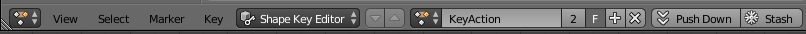
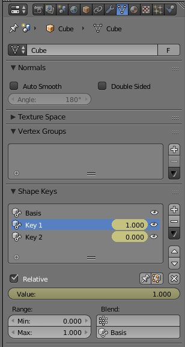
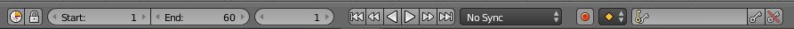

# Shape Animations

## Introduction
A common technique for creating face animations is to use 

In this tutorial we are going to explore how to create a couple poses and animate them

Terminology:
 - *Shape Keys*: a certain pose defined in Blender. This pose can be blended with other poses in different degrees to achieve new poses

## Set up
To make this tutorial simple the Animation is going to be applied only to the default cube.

To see a better representation of face animations, take a look at [this](examples/shape-animation.blend) example.

Create a new scene in Blender and split it into two, in the second view select `Dope Sheet` and `Shape Key Editor`.


Select the default cube and go to the `Vertex` or `Data` tab. Under `Shape Keys` press the `+` button three times to create three Shape Keys.


The Basis is the base shape and the other shape keys are going to be the poses that we apply over the base.

Select `Key 1` and go into `Edit Mode` (press tab).

Once you are in `Edit Mode` press `s` (scale), 2 and `Enter` to scale the cube two times.

Then select `Key 2` and press again `s`, write 0.5 and `Enter` to scale the cube to half size.

Now you have three shapes to animate.

Go into `Object Mode` by pressing tab and in the bottom you should see that the current frame is 1.


Select `Key 1` and in `value` set it all the way to 1.

Hover the mouse over `value` and press `i` to insert a keyframe at frame 1.

Then, select `Key 2` and leave `value` as it is, Hover the mouse over `value` and press `i` to insert a keyframe at frame 1 for `Key 2`.

You should see in the `Dope Sheet` view that now there is a new "Key Action", press `F` next to it to save the action by associating it with a fake user.

Now, set the current frame to 60 and repeat the above process but setting `value` to 0 for `Key 1` and 1 for `Key 2`, remember to insert the keyframes (the `value`s should turn yellow).

Set the `End` frame to 60 and press play to see the cube changing size. Of course this is a simple animation but with some imagination something much more complex can be achieved like face animations.

Last but not least in order for the `blender2ogre` add-on to properly export the animation it is necessary to turn it into an NLA Track, select the `Push Down` button next to the action name.


You can now go into the `NLA Editor` view and change the name of the NLA Track that name is the one that is going to be exported.

## Using Shape Animations in Ogre
Create an Entity and attach it to a SceneNode
```
Ogre::Entity* cube = mSceneMgr->createEntity("Cube", "Cube.mesh");
Ogre::SceneNode* cubeNode = mSceneMgr->getRootSceneNode()->createChildSceneNode("Cube");
cubeNode->attachObject(cube);
```

Get the AnimationState, enable it and set the starting time position
```
auto animationState = cube->getAnimationState("KeyAction");
animationState->setEnabled(true);
animationState->setTimePosition(0);
```

Then you need to `addTime()` to the *AnimationState*, we will use a controller for that.
```
auto& controllerMgr = Ogre::ControllerManager::getSingleton();

// Create a controller to pass the frame time to the Animation State, otherwise the animation won't play
// (this is a better method than using animationState->addTime() in your main loop)
controllerMgr.createFrameTimePassthroughController(Ogre::AnimationStateControllerValue::create(animationState, true));
```

For more information, please take a look at section [Vertex-Animation](https://ogrecave.github.io/ogre/api/latest/_animation.html#Vertex-Animation) in the manual.

And also consult the Ogre API manual:
 - https://ogrecave.github.io/ogre/api/latest/class_ogre_1_1_scene_manager.html
 - https://ogrecave.github.io/ogre/api/latest/class_ogre_1_1_animation_state.html
 - https://ogrecave.github.io/ogre/api/latest/class_ogre_1_1_scene_node.html
 - https://ogrecave.github.io/ogre/api/latest/class_ogre_1_1_controller_manager.html
 - https://ogrecave.github.io/ogre/api/latest/class_ogre_1_1_controller.html
