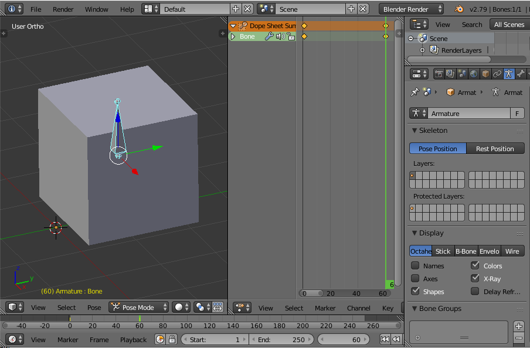

# Exporting Skeletal Animations

## Index
 - [Introduction](#introduction)
 - [Creating a basic rig](#creating-a-basic-rig)
 - [How does the exporter work?](#how-does-the-exporter-work-)
 - [Smooth Corrective Modifier](#smooth-corrective-modifier)
 - [Exporter Options](#exporter-options)
 - [Using Skeletal Animations in Ogre](#using-skeletal-animations-in-ogre)
 - [Tips/Troubleshooting](#tips-troubleshooting)
 - [Human Top+Base Animations](#human-top-base-animations)
 - [Random Tips from the forum](#random-tips-from-the-forum)
 - [Automation](#automation)

## Introduction
Skeletal Animation refers to the technique of using bones to deform a mesh as if the mesh were the skin.
The bones deform different parts of the mesh based on vertex weights that specify how much any bone should influence a certain part of the mesh.
This kind of animation is commonly used to animate characters in video games, but it's not limited to that.

Refer to the Blender Manual to know more about rigging: https://docs.blender.org/manual/en/2.79/rigging/index.html

## Creating a basic rig
To simplify the tutorial we will use the default cube just to show the basic concepts, for more complex tutorials check YouTube, for example:
 - [Blender 2.8 Tutorial : Rig ANY Character for Animation in 10 Minutes!](https://www.youtube.com/watch?v=SBYb1YmaOMY)
 - [Blender 2.82 Rigging Tutorial (In 2 Minutes!!!)](https://www.youtube.com/watch?v=PFaqjwpGxOc)

Start a new Blender scene with `Ctrl-N`.

Press `Shift-A -> Armature -> Single Bone` to add an Armature consisting of a single bone.

Select the Cube, then select the Armature (in that order) and press `Ctrl-P -> Armature Deform (With Automatic Weights)`.

Now the default cube is a child of the Armature and Blender has automatically created a Vertex Group named *Bone* on the Cube.

Select the Cube and go to the `Data` tab (the one that looks like an inverted triangle), there you will see a Vertex Group named *Bone*.

If you change the interaction mode to `Weight Paint` you will see that the cube suddenly becomes red, that color represents the strength of the weights assigned to the bone *Bone* where red is the strongest weight and blue is the weakest.

Split the Blender viewport to open a second view, bring up the Dopesheet editor and select the Action Editor context. 
Click "New" to add a new action and set a name for it, also don't forget to press the `F` button next to it (in Blender 2.7x, it is a shield in Blender 2.8+).
The purpose of that button is to avoid getting into a situation where the Action you create to animate your object has 0 users and the next time you open your .blend file the animation is gone.
One way for this to happen is if you press the `X` button then the action is no longer associated with the Armature and you will see a 0 next to it (it has 0 users) so Blender does not save it to disk.

Select the Armature and then set the mode to `Pose Mode`, this mode allows you to animate the bones.
Select the bone and now each time you press `I` a Keyframe is inserted and the proper keys for that bone are set.
Blender will ask each time which keys you want to insert, to make this process less tedious there is a box underneath the timeline where you can set `LocRot` for Blender to automatically insert location and rotation keys for each Keyframe you insert.

So, make sure that the current frame is `1` and insert a Keyframe. You will see that in the dopesheet now there is a Keyframe in the action.

Another interesting tidbit about actions is that they are composed of F-Curves and there is an F-Curve for each attribute of the bone being animated (location.x, location.y,... rotation.x, etc.).
And these F-Curves reference a vertex group by name (*Bone* in our case), an interesting thing is that if you have another Armature with bones with the same names and select the action in the dope sheet with that Armature selected then your animation will apply to that Armature as well. Of course, if the bones in the second Armature have the same names but different positions and orientations then the animation will look all wrong.
Transferring one set of animations from one Rig (a particular bone layout) to another is called Animation Retargeting, this is commonly used to transfer motion capture animations.
There is an official Blender plugin for Animation Retargeting but it is no longer being maintained, it is best to look up the subject in Google or YouTube.

OK, now go to frame `60` and move the bone to a different position/rotation of your choosing, the Cube should move with the bone since the weights have maximum influence. Insert another Keyframe with `I`.



Now there are two keyframes and you have a basic animation, set the `End:` frame to 60 and play the animation with `Alt-A` the cube should move and/or rotate from its original position to the one you set.

After finishing with the animation, press `Push Down` next to the action to add the action to the NLA Stack. This will indicate to the exporter that you want to export this action.

Change the Dopesheet editor to the NLA editor view and check that the action has an NLA Track, is advisable to change the NLA Track name since that will be the name of the animation in Ogre.

You can also play with an already made model to see how the process goes: [Stacy-rigged](https://www.turbosquid.com/FullPreview/Index.cfm/ID/535459).
It is advisable to try an export your model at every step of the process of making it more complex, to avoid getting into a situation where you put a lot of work into it and there are problems with the export.

## How does the exporter work?
To accommodate for complex animations with Inverse Kinematics, Drivers and modified F-Curves the exporter cannot simply export the Keyframes to Ogre because all the influences of these modifiers would be lost.
So what the exporter does is go frame by frame and have Blender calculate the bone transforms and export that information to the skeleton.xml file.
This means that your animation in Ogre has a keyframe for every single frame from the start of the animation to the end.
As a result of this setting `IM_SPLINE` for frame interpolation in Ogre would make no difference and might even slow down the skeletal animation.

If you only require key frames exported, then make sure the "Only Keyframes" option is ticked in the exporter properties.

## Smooth Corrective Modifier
https://docs.blender.org/manual/en/latest/modeling/modifiers/deform/corrective_smooth.html
The Smooth Corrective modifier is used to reduce highly distorted areas of a mesh by smoothing the deformations.
This is typically useful after an Armature modifier, where distortion around joints may be hard to avoid, even with careful weight painting.

## Exporter Options
 - *EX_ARMATURE_ANIMATION* (Armature Animation) : Export armature animations (updates the .skeleton file), enable this option to export the armature animations.
 - *EX_ONLY_KEYFRAMES* (Only Keyframes) : Exports only the keyframes. Influences that Inverse Kinematics, Drivers and modified F-Curves have on the animation will be lost.
 - *EX_ONLY_DEFORMABLE_BONES* (Only Deformable Bones) : Only exports bones that are deformable. Useful for hiding IK-Bones used in Blender. NOTE: Any bone with deformable children/descendants will be output as well
 - *EX_ONLY_KEYFRAMED_BONES* (Only Keyframed Bones) : Only exports bones that have been keyframed for a given animation. Useful to limit the set of bones on a per-animation basis
 - *EX_OGRE_INHERIT_SCALE* (OGRE Inherit Scale) : Whether the OGRE bones have the 'inherit scale' flag on. If the animation has scale in it, the exported animation needs to be adjusted to account for the state of the inherit-scale flag in OGRE.
 - *EX_TRIM_BONE_WEIGHTS* (Trim Weights) : Ignore bone weights below this value (Ogre supports 4 bones per vertex)

## Using Skeletal Animations in Ogre
Create an Entity and attach it to a SceneNode
```
Ogre::Entity* cube = mSceneMgr->createEntity("Cube", "Cube.mesh");
Ogre::SceneNode* cubeNode = mSceneMgr->getRootSceneNode()->createChildSceneNode("Cube");
cubeNode->attachObject(cube);
```

Get the AnimationState, enable it and set the starting time position
```
auto animationState = cube->getAnimationState("ArmatureAction");
animationState->setEnabled(true);
animationState->setTimePosition(0);
```

Then you need to `addTime()` to the *AnimationState*, we will use a controller for that.
```
auto& controllerMgr = Ogre::ControllerManager::getSingleton();

// Create a controller to pass the frame time to the Animation State, otherwise the animation won't play
// (this is a better method than using animationState->addTime() in your main loop)
controllerMgr.createFrameTimePassthroughController(Ogre::AnimationStateControllerValue::create(animationState, true));
```

If you are going to blend between animations
```
SkeletonInstance* skel = cube->getSkeleton();
skel->setBlendMode( ANIMBLEND_CUMULATIVE );
```

For more information, please take a look at section [Vertex-Animation](https://ogrecave.github.io/ogre/api/latest/_animation.html#Vertex-Animation) in the manual.

And also consult the Ogre API manual:
 - https://ogrecave.github.io/ogre/api/latest/class_ogre_1_1_scene_manager.html
 - https://ogrecave.github.io/ogre/api/latest/class_ogre_1_1_animation_state.html
 - https://ogrecave.github.io/ogre/api/latest/class_ogre_1_1_scene_node.html
 - https://ogrecave.github.io/ogre/api/latest/class_ogre_1_1_controller_manager.html
 - https://ogrecave.github.io/ogre/api/latest/class_ogre_1_1_controller.html
 - https://ogrecave.github.io/ogre/api/latest/class_ogre_1_1_skeleton.html

## Tips/Troubleshooting
Some useful tips to avoid problems or diagnose issues:
 - Before parenting a mesh to an armature remember to apply location, rotation and scale to avoid problems.
 - Remember to add your actions as NLA strips, otherwise they won't be recognized by the exporter.
 - If you're using IK bones, you need to keyframe the bones it is affecting as well otherwise the animation won't work in Ogre.

## Human Top+Base Animations
It is common for humanoid models to separate animations into top and bottom animations, 
that is for example to have a running animation separated into the legs animation (Base) and the torso + head animation (Top).
The objective is that if there is another animation (shooting an arrow, for example which involves only the Top bones) 
then it is possible to combine the animations: `RunningBase` and `ShootingTop` to have the character running and shooting arrows at the same time.

One good example of this comes with the Ogre SDK: Sinbad.zip. The Sinbad model has a `RunBase` and `RunTop` running animations.
Both animations have to be performed at the same time for the Sinbad character model to run using both arms and legs.

This requires on the Blender side creating the `RunningBase` and `RunningTop` animations, and for each one to *only* have keyframes the bones that correspond to the Top or Base of the model.

## Random Tips from the forum
Here are gathered some tips lifted from the forum: [Blender26 Ogre Exporter](https://forums.ogre3d.org/viewtopic.php?f=8&t=61485)

For combining animations at the same time, you may need to call `setUseBaseKeyFrame()` on the animations to tell OGRE which pose each of the animations should be relative to. By default, Ogre uses the skeleton bind pose.
The "base keyframe" should be a pose where the bones that should be untouched (like the top half of the character for the bottom animation) match exactly for ALL frames of the animation. Otherwise, you'll get unwanted extra rotations. So if you aren't setting the base key frame explicitly, then your animations should be authored such that the bones that should be untouched match the bind pose. The top half of the character should be in bind pose for the bottom animation. For details, see [setUseBaseKeyFrame()](https://ogrecave.github.io/ogre/api/latest/class_ogre_1_1_animation.html#a22780aed1bf68e2cd67e6dd62ac5c287)

The editor only exports the local coordinates and ignores any global transformation, unfortunately in Blender a skeleton and the mesh it is attached to can have different global transformations and take these into account when deforming the mesh. The easy solution to this is moving the skeleton in object-mode until it 'looks like' it is placed correctly, then press `Ctrl-A` to apply location, rotation and if necessary scale. This will set the global transform to zero and recalculate every local transformation to match the view. (apply this to both, skeleton and mesh).

"An object is not allowed to be scaled/rotated/translated before export": since I read that, I asked myself whether this would mean that all objects need to be default size and located in the origin, as created by "Add", which would be of somewhat reduced use. As it turned out, that meant the object is not allowed to have any LOCAL transformations to it. For example, instead of having a cube with dimensions (8, 2, 4) and a scale (0.5, 1.5, 2), one needs a cube of dimensions (4, 3, 8 ) and of scale (1, 1, 1). The same for rotation and location. This can be achieved by selecting the object, pressing `Ctrl-A`, and then selecting first "Location", followed by (after pressing `Ctrl-A` again) "Rotation & Scale". By doing so, all local transformations are applied to the object and reset to safe values.

Every time I had a problem with skeletons, I make sure that the mesh and the skeleton has the scale and rotation applied `Ctrl+A` and share the same position (origin in the same pos). For that you can select the skeleton, `Shift+S -> Cursor to selected`, then select the mesh, `Ctrl+Alt+Chift+C -> Origin to 3D Cursor`. Maybe it will mess up the envelope, so maybe is the other way around (first mesh then skeleton).

In very few cases, it has happened to me that if I apply an armature to a mesh, and later do the reset to that mesh, the animation in Ogre is a complete mess, in those cases what I had to do is unparent all bones from the mesh, erase the automatic Armature modifier in the "Objects Modifiers" window, and erase the Vertex Groups in the "Object Data" window, just mentioned if this happens to you.

The standard way of attaching equipment to a character is to attach it to a bone. Either with a constant offset to an existing bone (maybe the spine) or by creating extra non-deformable bones just for the purpose of attaching equipment to them which then can be moved in your animation to move the attached equipment in any way you like. The Sindbad character for example has extra bones at the sheaths on his back to properly place the swords in them when they are not drawn.

The blender2ogre exporter exports one skeleton for each mesh that is a child of an armature, if you have a character with different sets of clothing then you will have a base mesh with only the skin and meshes for the clothing/armor. All these meshes will be children of the same Armature with the same actions applied to all of them. That means that when exporting the Armature, every one of these meshes will be exported with their own .skeleton which takes time for many actions. So the recommendation is to have one .blend file with the Armature and the clothing sets and another .blend file with all the actions and only the base mesh to export. Then when you have all these meshes exported you need to modify them with meshmagick to change the skeleton name to a common one. Then in Ogre use `Ogre::Entity::shareSkeletonInstanceWith( Entity* entity )` to have the clothes animated at the same time as the base mesh, giving the illusion that the character has actual clothing.

Another recommendation regarding clothes: it is usual that in some poses the base mesh (skin) might get on top of the clothes which is undesired, one solution to this problem is to use shape keys to make the base model thinner and apply the shape key when the character has the clothes on since the shape won't be visible. Another option is to use the `Mask` modifier: create a vertex group for every part of the base mesh that will be visible with clothes on (like arms, head and ankles perhaps) and select that vertex group as the mask. With the mask active only those parts of the mesh will be exported.

## Automation
You might get excited animating your models and ending up with a lot of actions that have no corresponding NLA Track.

Going through every action, pushing it down into the NLA Track and renaming it is a very tedious process, so here is a simple script to automate that process.
```
import bpy

def add_NLA_strips(object):

    for action in bpy.data.actions:
        track = object.animation_data.nla_tracks.new()
        track.strips.new(action.name, action.frame_range[0], action)
        track.name = action.name

# Example for a single armature:
add_NLA_strips(bpy.data.objects['Armature'])

# If there are many armatures in the scene
for obj in bpy.data.objects:
	if obj.type != 'ARMATURE':
		continue
	
	add_NLA_strips(obj)
```
