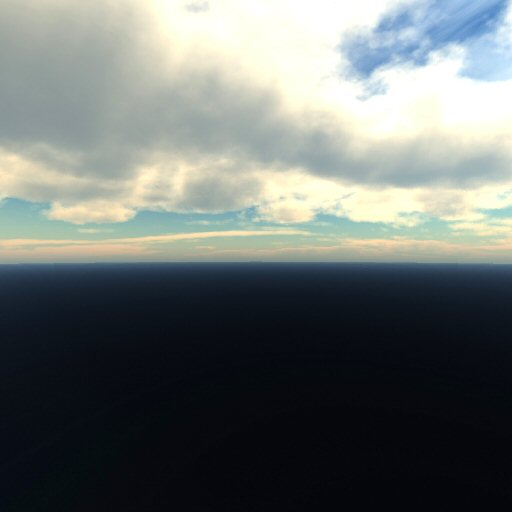
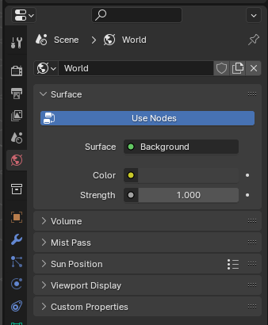
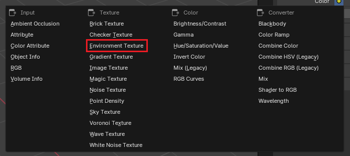
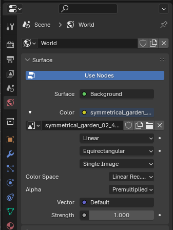
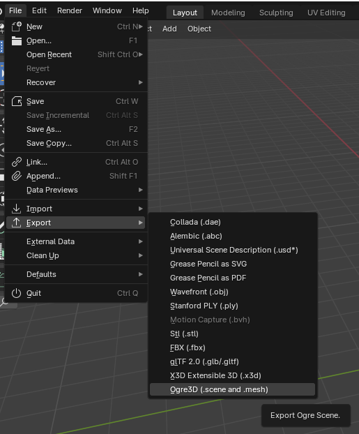
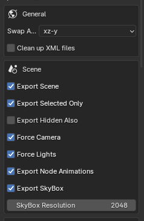
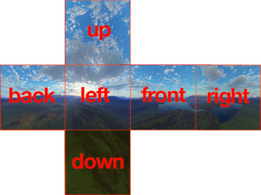

# Exporting SkyBoxes



## Documentation:
 - https://en.wikipedia.org/wiki/Skybox_(video_games)
 - https://ogrecave.github.io/ogre/api/latest/class_ogre_1_1_scene_manager.html#a370c23fff9cc351b150632c707a46700
 - https://docs.blender.org/manual/en/latest/render/lights/world.html

## Introduction
It is possible to export an HDRi map as a Cube Map that can be used in OGRE for SkyBoxes or environment maps.

## Setting the Environment Map in Blender
1) Go to `World Properties` Tab \


2) Then under "Surface", make sure that `Use Nodes` is checked. Surface should say "Background".

3) Then, where it says `Color` click on the white dot and a menu should appear to select the texture for the environment map. \


4) Open a Picture or select one from the Blender cache. \


5) Then select `File`->`Export`->`Ogre3D (.scene and .mesh)` \


6) In the `General` Settings, make sure to enable the option `Export SkyBox` and set the resolution to some power of 2 value (e.g.: 512, 1024, 2048, etc.). \
The higher the resolution the more time it will take for the exporting process. \


The exporter will create six images, one for each of the faces of the "SkyBox":
- front: "<texture_name>_fr.png"
- back: "<texture_name>_bk.png"
- right: "<texture_name>_rt.png"
- left: "<texture_name>_lf.png"
- top: "<texture_name>_up.png"
- bottom: "<texture_name>_dn.png"
 \


And a material with the same name as the environment texture.

## Using the SkyBox in OGRE
To load the SkyBox in OGRE it can be done with the DotScene Plugin, where you can use the .scene exported by `blender2ogre`.
 \
The exported scene has the following section:
```
...
  <environment >
    <colourBackground b="0.050876" g="0.050876" r="0.050876" />
    <skyBox active="true" material="symmetrical_garden_02" />
  </environment>
...
```

To use it in code you can do the following:
```
String material = "symmetrical_garden_02";
Real distance = 5000;
bool drawFirst = true;
bool active = true;
String groupName = "Scene";
mSceneMgr->setSkyBox(true, material, distance, drawFirst, rotation, groupName);
```
