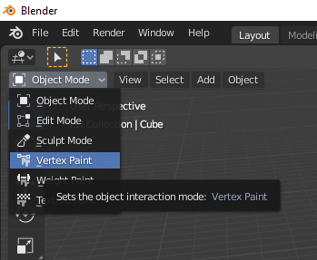

# Exporting Vertex Colors

## Introduction
It is possible to export the vertex color properties of objects in Blender.

## Creating Vertex Colors in Blender
1) Select the object you want to create Vertex Colors for

2) (Blender version < 3.2) Go the the `Object Data Properties` section and expand the Vertex Colors section \


3) (Blender version >= 3.2) Go the the `Object Data Properties` section and expand the Color Attributes section \


4) Press the + button to create the Vertex Color data

5) (Blender version < 3.2) \


6) (Blender version >= 3.2) You have to select `Face Corner` and `Byte Color` so that the Color data is compatible with the exporter \


7) Now that we have created the data block, it is time to fill it with something useful.
Change the mode to `Vertex Paint` and paint the vertices as you please. \


8) To see the results in Blender you have to create a Material that takes as input the Vertex Colors.
Go to the `Shading` tab and create a Material as follows: \


> **NOTE**: In Blender version >= 3.2 the input node is called `Color Attribute`

9) One last step is to modify the Material so that it is able to render transparency with EEVEE.
Go to the `Material Properties` section and set `Blend Mode: Alpha Hashed` and `Shadow Mode: None` for best results \


## About exporting and importing into Ogre
The exported vertex color property shows in the resulting mesh XML as follows:
```
...
    <sharedgeometry vertexcount="65">
        <vertexbuffer colours_diffuse="True" normals="true" positions="true" tangent_dimensions="0" tangents="False" texture_coords="1">
            <vertex>
                <position x="0.000000" y="-1.000000" z="-1.000000"/>
                <normal x="0.000000" y="0.447214" z="-0.894427"/>
                <colour_diffuse value="1.000000 1.000000 1.000000 1.000000"/>
                <texcoord u="0.250000" v="0.510000"/>
            </vertex>
...
```
The option `colours_diffuse="True"` is an indication to OGRE and also to the blender2ogre importer that the mesh has vertex colors.
The value shows as `<colour_diffuse value="1.000000 1.000000 1.000000 1.000000"/>` as a float4 with RGB values for color and a fourth value for the alpha.

To view the results in OGRE, the RTSS follows the normal diffuse colour flow, which can track vertex colours and contain alpha. 
See (vertexcolour): https://ogrecave.github.io/ogre/api/latest/_material-_scripts.html#autotoc_md128

If you're using your own shaders, then the vertex colour is passed to the vertex shader as the VES_COLOUR (5th element) and format: Colour, typically VET_UBYTE4.
https://ogrecave.github.io/ogre/api/latest/group___render_system.html#gac7ecb5ad110f918f709b3c5d5cbae655

Minimal example `vertex_color.vs`:
```
#version 330 core

layout (location = 0) in vec4 vertex;
layout (location = 2) in vec3 normal;
layout (location = 3) in vec4 colour;

out vec3 FragPos;
out vec3 Normal;
out vec4 vertexColor;

uniform mat4 world;
uniform mat4 worldViewProj;

void main()
{
    FragPos = vec3(world * vertex);
    Normal = normal;
    vertexColor = colour;
    
    gl_Position = worldViewProj * vertex;
}
```

Minimal example `vertex_color.fs`:
```
#version 330 core

in vec3 FragPos;
in vec4 vertexColor;
in vec3 vertexNormal;

out vec4 FragColor;

uniform vec3 lightPos; 
uniform vec3 lightColor;
uniform vec3 objectColor;

void main()
{
    // ambient
    float ambientStrength = 0.3;
    vec3 ambient = ambientStrength * lightColor;

    // diffuse 
    vec3 norm = normalize(vertexNormal);
    vec3 lightDir = normalize(lightPos - FragPos);
    float diff = max(dot(norm, lightDir), 0.0);
    vec3 diffuse = diff * lightColor;
 
    vec3 result = (ambient + diffuse) * vec3(vertexColor);
    FragColor = vec4(result, vertexColor.a);
}
```

Program:
```
vertex_program Vertex-ColorVS glsl 
{
    source "vertex_color.vs"

    default_params
    {
        param_named_auto world world_matrix
        param_named_auto worldViewProj worldviewproj_matrix
    }
}

fragment_program Vertex-ColorFS glsl 
{
    source "vertex_color.fs"

    default_params
    {
        param_named_auto lightPos light_position 0
        param_named lightColor float3 1.0 1.0 1.0
    }
}
```

Material:
```
material VertexColor {
    receive_shadows on
    technique {
        pass {
            lighting on
            ambient 0.8 0.8 0.8 1.0
            diffuse 0.64 0.64 0.64 1.0
            specular 0.5 0.5 0.5 1.0 12.5
            emissive 0.0 0.0 0.0 1.0

            //scene_blend one zero 

            vertex_program_ref Vertex-ColorVS 
            {
            }

            fragment_program_ref Vertex-ColorFS
            {
            }
        }
    }
}
```

## Troubleshooting
Some tips for troubleshooting:
 - For Blender versions >= 3.2 make sure that the color data is set to `Face Corner` and `Byte Color`.
 - Beware of selecting an object and directly changing the mode to `Vertex Paint` because the color data is automatically created.
